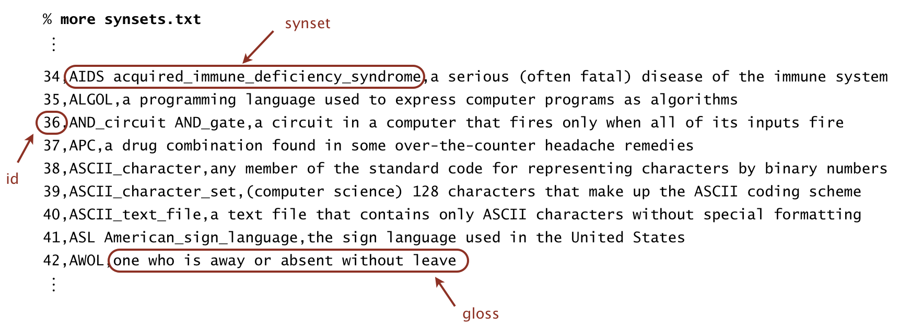
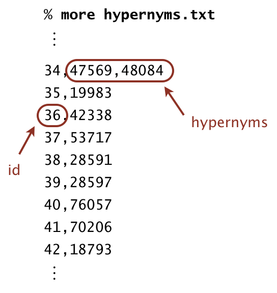
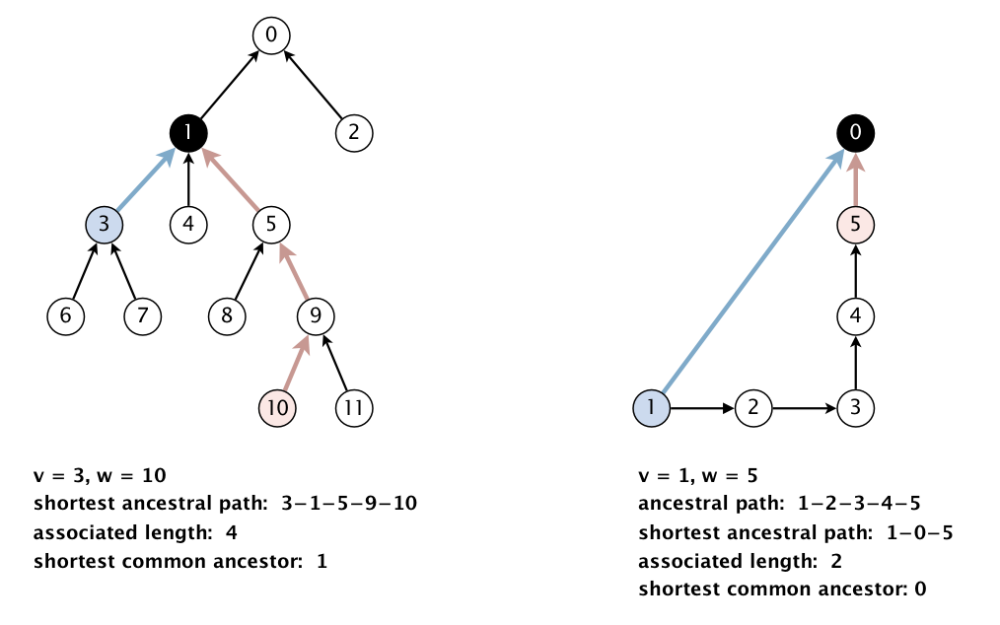
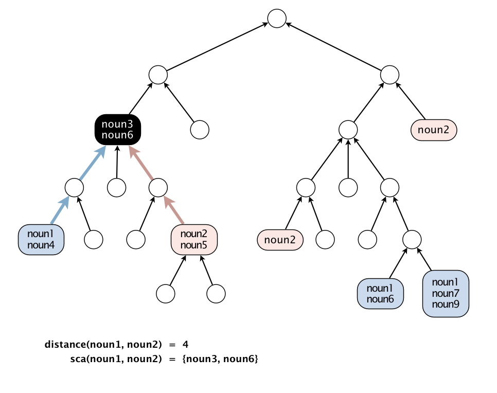

# WordNet

https://coursera.cs.princeton.edu/algs4/assignments/wordnet/specification.php


------

[WordNet](http://wordnet.princeton.edu/) is a semantic lexicon for the English language that computational linguists and cognitive scientists use extensively. For example, WordNet was a key component in IBM's Jeopardy-playing [Watson](http://en.wikipedia.org/wiki/Watson_(computer)) computer system. WordNet groups words into sets of synonyms called *synsets*. For example, { *AND circuit*, *AND gate* } is a synset that represent a logical gate that fires only when all of its inputs fire. WordNet also describes semantic relationships between synsets. One such relationship is the *is-a* relationship, which connects a *hyponym* (more specific synset) to a *hypernym* (more general synset). For example, the synset { *gate*, *logic gate* } is a hypernym of { *AND circuit*, *AND gate* } because an AND gate is a kind of logic gate.

**The WordNet digraph.** Your first task is to build the WordNet digraph: each vertex *v* is an integer that represents a synset, and each directed edge *v→w* represents that *w* is a hypernym of *v*. The WordNet digraph is a *rooted DAG*: it is acyclic and has one vertex—the *root*—that is an ancestor of every other vertex. However, it is not necessarily a tree because a synset can have more than one hypernym. A small subgraph of the WordNet digraph appears below.


**The WordNet input file formats.** We now describe the two data files that you will use to create the WordNet digraph. The files are in *comma-separated values* (CSV) format: each line contains a sequence of fields, separated by commas.

- *List of synsets.* The file [`synsets.txt`](https://coursera.cs.princeton.edu/algs4/assignments/wordnet/files/synsets.txt) contains all noun synsets in WordNet, one per line. Line *i* of the file (counting from 0) contains the information for synset *i*. The first field is the *synset id*, which is always the integer *i*; the second field is the synonym set (or *synset*); and the third field is its dictionary definition (or *gloss*), which is not relevant to this assignment.

  

  For example, line 36 means that the synset { `AND_circuit`, `AND_gate` } has an id number of 36 and its gloss is `a circuit in a computer that fires only when all of its inputs fire`. The individual nouns that constitute a synset are separated by spaces. If a noun contains more than one word, the underscore character connects the words (and not the space character).

- *List of hypernyms.* The file [`hypernyms.txt`](https://coursera.cs.princeton.edu/algs4/assignments/wordnet/files/hypernyms.txt) contains the hypernym relationships. Line *i* of the file (counting from 0) contains the hypernyms of synset *i*. The first field is the synset id, which is always the integer *i*; subsequent fields are the id numbers of the synset's hypernyms.

  

  For example, line 36 means that synset 36 (`AND_circuit AND_Gate`) has 42338 (`gate logic_gate`) as its only hypernym. Line 34 means that synset 34 (`AIDS acquired_immune_deficiency_syndrome`) has two hypernyms: 47569 (`immunodeficiency`) and 48084 (`infectious_disease`).

**WordNet data type.** Implement an immutable data type `WordNet` with the following API:

```java
public class WordNet {

    // constructor takes the name of the two input files
    public WordNet(String synsets, String hypernyms)

    // returns all WordNet nouns
    public Iterable<String> nouns()

    // is the word a WordNet noun?
    public boolean isNoun(String word)

    // distance between nounA and nounB (defined below)
    public int distance(String nounA, String nounB)

    // a synset (second field of synsets.txt) that is the common ancestor of nounA and nounB
    // in a shortest ancestral path (defined below)
    public String sap(String nounA, String nounB)

    // do unit testing of this class
    public static void main(String[] args)
    
}
```

*Corner cases.* Throw an `IllegalArgumentException` in the following situations:

- Any argument to the constructor or an instance method is `null`.
- The input to the constructor does not correspond to a rooted DAG.
- Any of the noun arguments in `distance()` or `sap()` is not a WordNet noun.

You may assume that the input files are in the specified format.

*Performance requirements.* Your data type should use space linear in the input size (size of synsets and hypernyms files). The constructor should take time linearithmic (or better) in the input size. The method `isNoun()` should run in time logarithmic (or better) in the number of nouns. The methods `distance()` and `sap()` should run in time linear in the size of the WordNet digraph. For the analysis, assume that the number of nouns per synset is bounded by a constant.

**Shortest ancestral path.** An *ancestral path* between two vertices *v* and *w* in a digraph is a directed path from *v* to a common ancestor *x*, together with a directed path from *w* to the same ancestor *x*. A *shortest ancestral path* is an ancestral path of minimum total length. We refer to the common ancestor in a shortest ancestral path as a *shortest common ancestor*. Note also that an ancestral path is a path, but not a directed path.



We generalize the notion of shortest common ancestor to *subsets* of vertices. A shortest ancestral path of two subsets of vertices *A* and *B* is a shortest ancestral path over all pairs of vertices *v* and *w*, with *v* in *A* and *w* in *B*. The figure ([`digraph25.txt`](https://coursera.cs.princeton.edu/algs4/assignments/wordnet/files/digraph25.txt)) below shows an example in which, for two subsets, red and blue, we have computed several (but not all) ancestral paths, including the shortest one.


**SAP data type.** Implement an immutable data type `SAP` with the following API:

```java
public class SAP {

    // constructor takes a digraph (not necessarily a DAG)
    public SAP(Digraph G)

    // length of shortest ancestral path between v and w; -1 if no such path
    public int length(int v, int w)

    // a common ancestor of v and w that participates in a shortest ancestral path; -1 if no such path
    public int ancestor(int v, int w)

    // length of shortest ancestral path between any vertex in v and any vertex in w; -1 if no such path
    public int length(Iterable<Integer> v, Iterable<Integer> w)

    // a common ancestor that participates in shortest ancestral path; -1 if no such path
    public int ancestor(Iterable<Integer> v, Iterable<Integer> w)

    // do unit testing of this class
    public static void main(String[] args)

}
```

*Corner cases.* Throw an `IllegalArgumentException` in the following situations:

- Any argument is `null`.
- Any vertex argument is outside its prescribed range.
- Any iterable argument contains a `null` item.

*Performance requirements.* All methods (and the constructor) should take time at most proportional to *E* + *V* in the worst case, where *E* and *V* are the number of edges and vertices in the digraph, respectively. Your data type should use space proportional to *E* + *V*.

**Test client.** The following test client takes the name of a digraph input file as as a command-line argument, constructs the digraph, reads in vertex pairs from standard input, and prints out the length of the shortest ancestral path between the two vertices and a common ancestor that participates in that path:

```java
public static void main(String[] args) {
    In in = new In(args[0]);
    Digraph G = new Digraph(in);
    SAP sap = new SAP(G);
    while (!StdIn.isEmpty()) {
        int v = StdIn.readInt();
        int w = StdIn.readInt();
        int length = sap.length(v, w);
        int ancestor = sap.ancestor(v, w);
        StdOut.printf("length = %d, ancestor = %d\n", length, ancestor);
    }
}
```

Here is a sample execution:

```powershell
% cat digraph1.txt
13
11
 7  3
 8  3
 3  1
 4  1
 5  1
 9  5
10  5
11 10
12 10
 1  0
 2  0

% java-algs4 SAP digraph1.txt
3 11
length = 4, ancestor = 1
                         
9 12
length = 3, ancestor = 5

7 2
length = 4, ancestor = 0

1 6
length = -1, ancestor = -1
```

**Measuring the semantic relatedness of two nouns**. Semantic relatedness refers to the degree to which two concepts are related. Measuring semantic relatedness is a challenging problem. For example, you consider *George W. Bush* and *John F. Kennedy* (two U.S. presidents) to be more closely related than *George W. Bush* and *chimpanzee* (two primates). It might not be clear whether *George W. Bush* and *Eric Arthur Blair* are more related than two arbitrary people. However, both *George W. Bush* and *Eric Arthur Blair* (a.k.a. George Orwell) are famous communicators and, therefore, closely related.

We define the semantic relatedness of two WordNet nouns *x* and *y* as follows:

- *A* = set of synsets in which *x* appears
- *B* = set of synsets in which *y* appears
- *distance*(*x, y*) = length of shortest ancestral path of subsets *A* and *B*
- *sca*(*x, y*) = a shortest common ancestor of subsets *A* and *B*

This is the notion of distance that you will use to implement the `distance()` and `sap()` methods in the `WordNet` data type.



**Outcast detection.** Given a list of WordNet nouns *x*<sub>1</sub>, *x*<sub>2</sub>, ..., *x*<sub>*n*</sub>, which noun is the least related to the others? To identify *an outcast*, compute the sum of the distances between each noun and every other one:

> *d*<sub>*i*</sub>  =  *distance*(*x*<sub>*i*</sub>, *x*<sub>1</sub>)  +  *distance*(*x*<sub>*i*</sub>, *x*<sub>2</sub>)  +  ...  +  *distance*(*x*<sub>*i*</sub>, *x*<sub>*n*</sub>)

and return a noun *x*<sub>*t*</sub> for which *d*<sub>*t*</sub> is maximum. Note that *distance*(*x*<sub>*i*</sub>, *x*<sub>*i*</sub>) = 0, so it will not contribute to the sum.

Implement an immutable data type `Outcast` with the following API:

```java
public class Outcast {

    // constructor takes a WordNet object
    public Outcast(WordNet wordnet)

    // given an array of WordNet nouns, return an outcast
    public String outcast(String[] nouns)

    // see test client below
    public static void main(String[] args)

}
```

Assume that argument to `outcast()` contains only valid wordnet nouns (and that it contains at least two such nouns).

The following test client takes from the command line the name of a synset file, the name of a hypernym file, followed by the names of outcast files, and prints out an outcast in each file:

```java
public static void main(String[] args) {
    WordNet wordnet = new WordNet(args[0], args[1]);
    Outcast outcast = new Outcast(wordnet);
    for (int t = 2; t < args.length; t++) {
        In in = new In(args[t]);
        String[] nouns = in.readAllStrings();
        StdOut.println(args[t] + ": " + outcast.outcast(nouns));
    }
}
```

Here is a sample execution:

```powershell
% cat outcast5.txt
horse zebra cat bear table

% cat outcast8.txt
water soda bed orange_juice milk apple_juice tea coffee

% cat outcast11.txt
apple pear peach banana lime lemon blueberry strawberry mango watermelon potato


% java-algs4 Outcast synsets.txt hypernyms.txt outcast5.txt outcast8.txt outcast11.txt
outcast5.txt: table
outcast8.txt: bed
outcast11.txt: potato
```

**Analysis of running time (optional).** Analyze the effectiveness of your approach to this problem by giving estimates of its time requirements.

- Give the order of growth of the *worst-case* running time of the `length()` and `ancestor()` methods in `SAP` as a function of the number of vertices *V* and the number of edges *E* in the digraph.
- Give the order of growth of the *best-case* running time of the same methods.

**Web submission.** Submit a .zip file containing `WordNet.java`, `SAP.java`, `Outcast.java`, any other supporting files (excluding `algs4.jar`). You may not call any library functions except those in `java.lang`, `java.util`, and `algs4.jar`.

------

*This assignment was developed by Alina Ene and Kevin Wayne.*

*Copyright © 2006.*