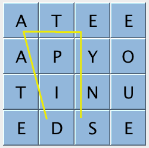

# Boggle

https://coursera.cs.princeton.edu/algs4/assignments/boggle/specification.php


------

Write a program to play the word game Boggle®.

**The Boggle game.** Boggle is a word game designed by *Allan Turoff* and distributed by *Hasbro*. It involves a board made up of 16 cubic dice, where each dice has a letter printed on each of its 6 sides. At the beginning of the game, the 16 dice are shaken and randomly distributed into a 4-by-4 tray, with only the top sides of the dice visible. The players compete to accumulate points by building *valid* words from the dice, according to these rules:

- A valid word must be composed by following a sequence of *adjacent dice*—two dice are adjacent if they are horizontal, vertical, or diagonal neighbors.
- A valid word can use each dice at most once.
- A valid word must contain at least 3 letters.
- A valid word must be in the dictionary (which typically does not contain proper nouns).

Here are some examples of valid and invalid words:

- PINS (*valid*)

  

- PINES (*valid*)

  

- DATES (*invalid—dice not adjacent*)

  

- PINT (*invalid—path not sequential*)

  

- TEPEE (*invalid—dice used more than once*)

  

- SID (*invalid—word not in dictionary*)

  

**Scoring.** Valid words are scored according to their length, using this table:

| *word length* | *points* |
| :-----------: | :------: |
|      3–4      |    1     |
|       5       |    2     |
|       6       |    3     |
|       7       |    5     |
|      8+       |    11    |

**The *Qu* special case.** In the English language, the letter `Q` is almost always followed by the letter `U`. Consequently, the side of one dice is printed with the two-letter sequence `Qu` instead of `Q` (and this two-letter sequence must be used together when forming words). When scoring, `Qu` counts as two letters; for example, the word `QuEUE` scores as a 5-letter word even though it is formed by following a sequence of only 4 dice.


**Your task.** Your challenge is to write a Boggle solver that finds *all* valid words in a given Boggle board, using a given dictionary. Implement an immutable data type `BoggleSolver` with the following API:

```java
public class BoggleSolver {

    // Initializes the data structure using the given array of strings as the dictionary.
    // (You can assume each word in the dictionary contains only the uppercase letters A through Z.)
    public BoggleSolver(String[] dictionary)

    // Returns the set of all valid words in the given Boggle board, as an Iterable.
    public Iterable<String> getAllValidWords(BoggleBoard board)

    // Returns the score of the given word if it is in the dictionary, zero otherwise.
    // (You can assume the word contains only the uppercase letters A through Z.)
    public int scoreOf(String word)

}
```

It is up to you how you search for and store the words contained in the board, as well as the dictionary used to check them.

**The board data type.** We provide an immutable data type [`BoggleBoard.java`](https://coursera.cs.princeton.edu/algs4/assignments/boggle/files/BoggleBoard.java) for representing Boggle boards. It includes constructors for creating Boggle boards from either the 16 Hasbro dice, the distribution of letters in the English language, a file, or a character array; methods for accessing the individual letters; and a method to print out the board for debugging. Here is the full API:

```java
public class BoggleBoard {

    // Initializes a random 4-by-4 Boggle board.
    // (by rolling the Hasbro dice)
    public BoggleBoard()

    // Initializes a random m-by-n Boggle board.
    // (using the frequency of letters in the English language)
    public BoggleBoard(int m, int n)

    // Initializes a Boggle board from the specified filename.
    public BoggleBoard(String filename)

    // Initializes a Boggle board from the 2d char array.
    // (with 'Q' representing the two-letter sequence "Qu")
    public BoggleBoard(char[][] a)

    // Returns the number of rows.
    public int rows()

    // Returns the number of columns.
    public int cols()

    // Returns the letter in row i and column j.
    // (with 'Q' representing the two-letter sequence "Qu")
    public char getLetter(int i, int j)

    // Returns a string representation of the board.
    public String toString()

}
```

**Testing.** The zip file [`boggle.zip`](https://coursera.cs.princeton.edu/algs4/assignments/boggle/boggle.zip) contains a number of sample boards and test files.

- *Dictionaries.* A dictionary consists of a sequence of words, separated by whitespace, in alphabetical order. You can assume that each word contains only the uppercase letters `A` through `Z`. For example, here are the two files [`dictionary-algs4.txt`](https://coursera.cs.princeton.edu/algs4/assignments/boggle/files/dictionary-algs4.txt) and [`dictionary-yawl.txt`](https://coursera.cs.princeton.edu/algs4/assignments/boggle/files/dictionary-yawl.txt):

  ```console
  ~/Desktop/boggle> cat dictionary-algs4.txt
  ABACUS
  ABANDON
  ABANDONED
  ABBREVIATE
  ...
  QUEUE
  ...
  ZOOLOGY
  
  ~/Desktop/boggle> cat dictionary-yawl.txt
  AA
  AAH
  AAHED
  AAHING
  ...
  PNEUMONOULTRAMICROSCOPICSILICOVOLCANOCONIOSIS
  ...
  ZYZZYVAS
  ```

  The former is a list of 6,013 words that appear in *Algorithms 4/e*; the latter is a comprehensive list of 264,061 English words (known as *Yet Another Word List*) that is widely used in word-game competitions.

- *Boggle boards.* A boggle board consists of two integers *m* and *n*, followed by the *m* × *n* characters in the board, with the integers and characters separated by whitespace. You can assume the integers are nonnegative and that the characters are uppercase letters `A` through `Z` (with the two-letter sequence `Qu` represented as either `Q` or `Qu`). For example, here are the files [`board4x4.txt`](https://coursera.cs.princeton.edu/algs4/assignments/boggle/files/board4x4.txt) and [`board-q.txt`](https://coursera.cs.princeton.edu/algs4/assignments/boggle/files/board-q.txt):

  ```console
  ~/Desktop/boggle> cat board4x4.txt
  4 4
  A  T  E  E
  A  P  Y  O
  T  I  N  U
  E  D  S  E
  
  ~/Desktop/boggle> cat board-q.txt
  4 4
  S  N  R  T
  O  I  E  L
  E  Qu T  T
  R  S  A  T
  ```

The following test client takes the filename of a dictionary and the filename of a Boggle board as command-line arguments and prints out all valid words for the given board using the given dictionary.

```java
public static void main(String[] args) {
    In in = new In(args[0]);
    String[] dictionary = in.readAllStrings();
    BoggleSolver solver = new BoggleSolver(dictionary);
    BoggleBoard board = new BoggleBoard(args[1]);
    int score = 0;
    for (String word : solver.getAllValidWords(board)) {
        StdOut.println(word);
        score += solver.scoreOf(word);
    }
    StdOut.println("Score = " + score);
}
```

Here are two sample executions:

```console
~/Desktop/boggle> java-algs4 BoggleSolver dictionary-algs4.txt board4x4.txt
AID
DIE
END
ENDS
...
YOU
Score = 33

~/Desktop/boggle> java-algs4 BoggleSolver dictionary-algs4.txt board-q.txt
EQUATION
EQUATIONS
...
QUERIES
QUESTION
QUESTIONS
...
TRIES
Score = 84
```

**Performance.** If you choose your data structures and algorithms judiciously, your program can preprocess the dictionary and find all valid words in a random Hasbro board (or even a random 10-by-10 board) in a fraction of a second. To stress test the performance of your implementation, create one `BoggleSolver` object (from a given dictionary); then, repeatedly generate and solve random Hasbro boards. How many random Hasbro boards can you solve per second? *For full credit, your program must be able to solve thousands of random Hasbro boards per second.* The goal on this assignment is raw speed—for example, it's fine to use 10× more memory if the program is 10× faster.

**Interactive game (optional, but fun and no extra work).** Once you have a working version of `BoggleSolver.java`, download, compile, and run [`BoggleGame.java`](https://coursera.cs.princeton.edu/algs4/assignments/boggle/files/BoggleGame.java) to play Boggle against a computer opponent. To enter a word, either type it in the text box or click the corresponding sequence of dice on the board. The computer opponent has various levels of difficulty, ranging from finding only words from popular nursery rhymes (easy) to words that appear in *Algorithms 4/e* (medium) to finding every valid word (humbling).


**Challenge for the bored.** Here are some challenges:

- Find a maximum scoring 4-by-4 Hasbro board. Here is the [best known board](https://coursera.cs.princeton.edu/algs4/assignments/boggle/files/board-points4540.txt) (4540 points), which was discovered by *Robert McAnany* in connection with this *Coursera* course.
- Find a maximum scoring 4-by-4 Hasbro board using the [*Zinga*](https://coursera.cs.princeton.edu/algs4/assignments/boggle/files/dictionary-zingarelli2005.txt) list of 584,983 Italian words.
- Find a minimum scoring 4-by-4 Hasbro board.
- Find a maximum scoring 5-by-5 Deluxe Boggle board.
- Find a maximum scoring *n*-by-*n* board (not necessarily using the Hasbro dice) for different values of *n*.
- Find a board with the most words (or the most words that are 8 letters or longer).
- Find a 4-by-4 Hasbro board that scores *exactly* 2,500, 3,000, 3,500, or 4,000 points.
- Design an algorithm to determine whether a given 4-by-4 board can be generated by rolling the 16 Hasbro dice.
- How many words in the dictionary appear in no 4-by-4 Hasbro boards?
- Add new features to [`BoggleGame.java`](https://coursera.cs.princeton.edu/algs4/assignments/boggle/files/BoggleGame.java).
- Extend your program to handle arbitrary Unicode letters and dictionaries. You may need to consider alternate algorithms and data structures.
- Extend your program to handle arbitrary strings on the faces of the dice, generalizing your hack for dealing with the two-letter sequence `Qu`.

Unless otherwise stated, use the [`dictionary-yawl.txt`](https://coursera.cs.princeton.edu/algs4/assignments/boggle/files/dictionary-yawl.txt) dictionary. If you discover interesting boards, you are encouraged to share and describe them in the *Discussion Forums*.

**Web submission.** Submit a .zip file containing Submit `BoggleSolver.java` and any other supporting files (excluding `BoggleBoard.java` and `algs4.jar`). You may not call any library functions except those in `java.lang`, `java.util`, and `algs4.jar`.

------

*This assignment was developed by Matthew Drabick and Kevin Wayne, inspired by Todd Feldman and Julie Zelenski's classic*

*[Nifty Boggle](http://www-cs-faculty.stanford.edu/~zelenski/boggle/) assignment from Stanford.*

*Copyright © 2013.*