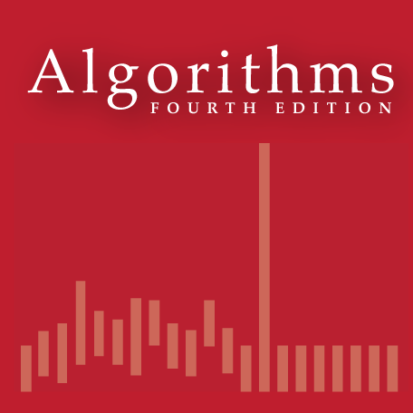

# "Algorithms" Assignments On Coursera

## Introduction

This course covers the essential information that every serious programmer needs to know about algorithms and data structures, with emphasis on applications and scientific performance analysis of *Java* implementations, including elementary data structures, sorting, searching, graph-processing and string-processing algorithms.

## Course Website

https://www.coursera.org/learn/algorithms-part1

https://www.coursera.org/learn/algorithms-part2